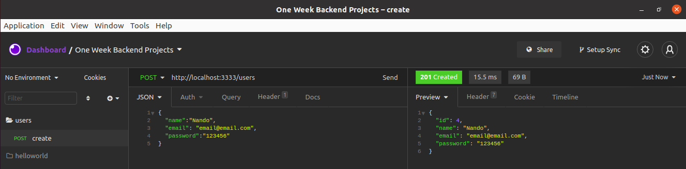
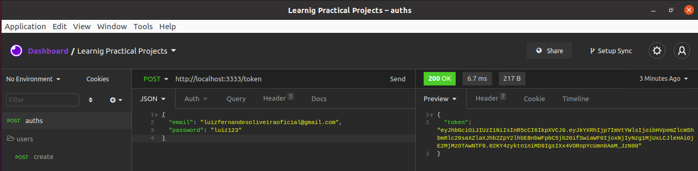
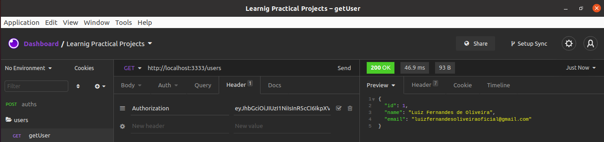
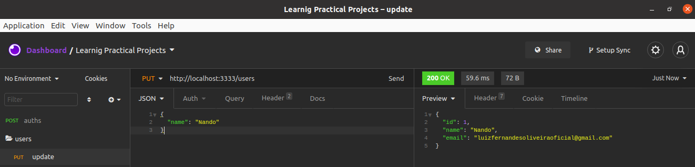
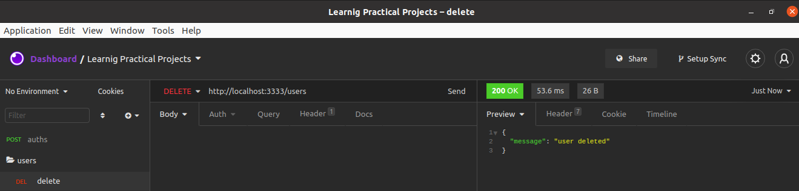

# #2 Authentication with JWT


### Problemática

criar um API que rode na porta 3333 que tenha um C.R.U.D. de Usuário e que para acessar os R.U.D. o usuário deve ter um token fornecido por uma autenticação feita com o JWT.

**Recursos**
- `HTTP/1.1 POST /users`



- `HTTP/1.1 POST /token`



- `HTTP/1.1 GET /user`



- `HTTP/1.1 PUT /user`



- `HTTP/1.1 DELETE /user`




### Starting
 - **Configurando variáveis de ambiente**
   
   Primeiramente crie um arquivo chamado **.env** no diretório raiz da aplicação. E, em seguida, adicione as seguintes variáveis nele. 
    **Lembre-se de alterar o valor, conforme o seu ambiente**
    ```
    PORT=3333
    JWT_SECRET=secret
    DB_USER_=postgres
    DB_PASS_=291197
    DB_NAME_=authUsers
    DB_HOST_=localhost
    DB_DIALECT_=postgres
    ```
 - **Inicializando aplicação**
   
   Para inicializar a aplicação basta rodar o seguinte comando:
   ```shellscript
   yarn debug
   ```

 - **Testando aplicação**
   
   Para inicializar os tests basta startar a aplicação e, em seguida, digitar o seguinte comando:
   **OBS:** afim de ter tests rápidos, os mesmos foram criados de forma que é necessário startar a aplicação sempre antes de rodar os tests. 
   ```shellscript
   yarn test
   ```